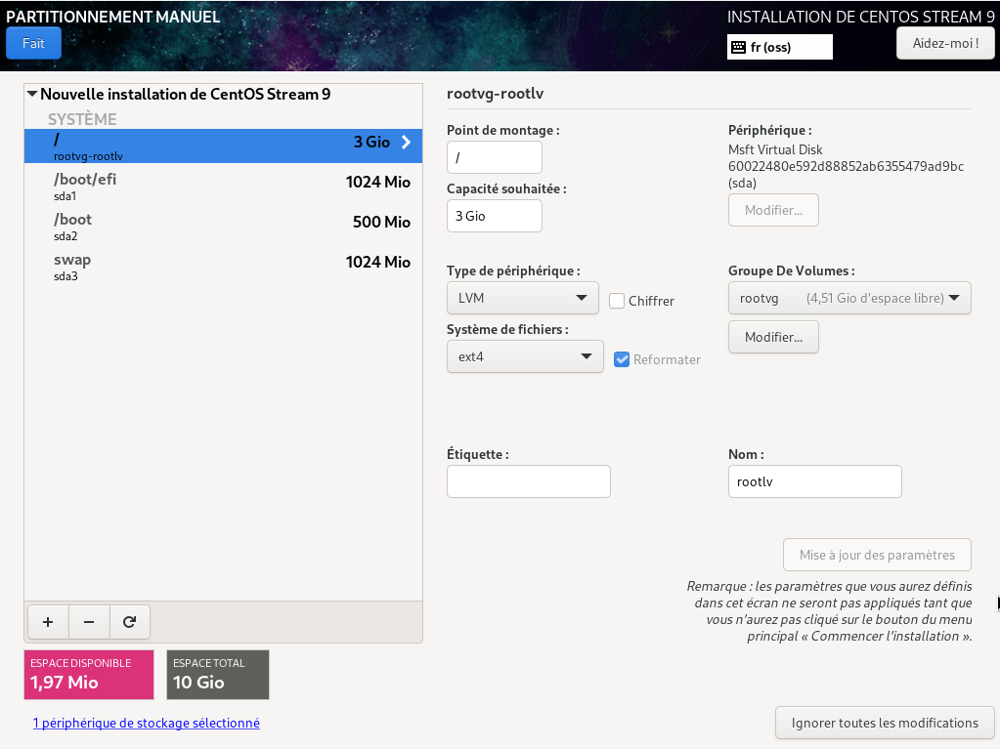

---
hide:
  - footer
---

# Centos

- kickstart (redhat) = methode d'installation qui permet de faire passer les questions d'installation
    - utilisation avec la modification de l'ecran d'installation

## Procédure

- installation manuellement
- Récuparation du fichier /rot/anaconda-ks.cfg --> /srv/ks.cfg
- Mettre le fichier à disposition avec un client http = conteneur docker
- Installation nouvelle VM avec l'utilisation du fichier KS
> inst.ks=https://...../ks.cfg
- si problème résolution : inst.resolution=1080x1920

### Cahier des charges 
- 3 partitions :
    - /boot : 500Mo, format ext2
    - Swap : 1Go
    - Système de fichier racine (/), ext4, 3 Go, mais sur du LVM, volume groupe = rootvg, volume logique = rootlv

### Rappels 

- LVM : Logical Volume Manager
- PV : Physical volume 
- VG : Volume Volume (prends l'intégralité des PV)
- LG : Logical Volume (Volumes logiques crées sur le VG et permet d'utiliser des systemes de fichier différents) exemples :
    - LV1 /leo (ext4)
    - LV2 /data1 (EXT3)
    - LV3 /data2 (EXT4)

 
*Schéma de LVM*

## Installation CENTOS9

- Choix du clavier
- Mise en place du partitionnement

### Installation docker

!!! info annotate "Rappel sur docker"

    Site de documentation docker : https://docs.docker.com
    
    Selon la firme de recherche sur l'industrie 451 Research, « Docker est un outil qui peut empaqueter une application et ses dépendances dans un conteneur isolé, qui pourra être exécuté sur n'importe quel serveur ». Il ne s'agit pas de virtualisation, mais de conteneurisation, une forme plus légère qui s'appuie sur certaines parties de la machine hôte pour son fonctionnement.

- Copier le fichier ananconda
    - >  cp anaconda-ks.cfg /srv/kickstart/ks.cfg

- installer docker avec CURL 
    - > curl -sSL https://get.docker.com | sudo bash
    
    ou sinon : 

    - > curl -sSl -o get-docker.sh https://get.docker.com
        
    - > controle : get-docker.sh
    - > execution : bash get-docker.sh

- Demarrage et automatisation de docker au boot

    - > systemctl enable --now docker.service

- Démarrage d'un conteneur de serveur web
    
    Apache
    - > docker container run -d --name websrv --publish 80:80 --volume /srv/kickstart:/usr/local/apache2/htdocs  httpd

    Ngnix
    - > docker container run -d --name websrv --publish 80:80  --volume /srv/kickstart:/usr/share/nginx/html  nginx

- Verficiation des user dans docker 

    - > docker container top websrv

- Mise à jour des permissions 

    - > chmod 644 /srv/kickstart/ks.cfg

- Installation de micro 

    - > curl https://getmic.ro | bash
    - > mv micro /usr/local/bin
    - > ln -s /usr/local/bin/micro /usr/local/sbin/micro

- Changement pour enlever le mot de passe de user

    - > sed -i -e '/^%wheel/s,^,# ,' -e '/^# %wheel.*NOPASSWD/s,^# ,,' /etc/sudoers

        Le -i prend en compte pour l'execution

## Mise en place de l'anaconda pour installer d'autres machines

### Cahier des charges

 - "micro" doit etre installé dans /usr/local/bin
 - Lien symbolique dans /usr/local/bin 
 - User n'a pas à s'identifier pour sudo ... No PASSWD
 - On ne peut se connecter en trannt que "user" avec une clé punlique definie ici

### Extention du volume groupe

- Création du volume dans le sdb

> pvcreate /dev/sdb

- Extentention du volume groupe sur le nouveau disque

> vgextend /dev/rootvg /dev/sdb

- Extention du volume logique 

> lvextend -l 100%FREE -r /dev/rootvg/rootlv

### modification du SSH

- Création des dossier ssh (/.ssh/authorized_keys)

> .ssh avec les droits 700

> authorized_keys avec les droits 600

# Debian

- Preseed (debian) = methode d'installation qui permet de faire passer les questions d'installation