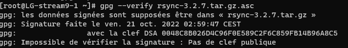
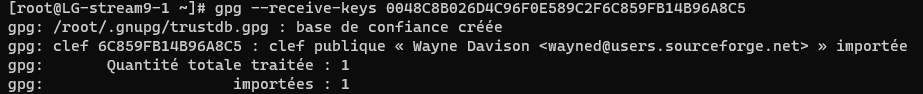
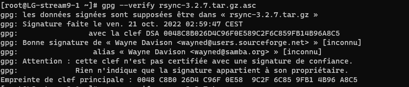

---
hide:
  - footer
---

# Programme du jour 

- Manipuler rpm et yum
- Compiler un logiciel libre (à partir des sources)
- Créer un pakcage RPM
- Créer un dépôt pour mettre à dispo mes packages
- Déclarer mon dépôt sur les pc clients


# Manipuler rpm et yum

## RPM

RPM : commande pour manipuler des package et savoir les informations sur ceux-ci

- Options :

* -q query => Information de version
* -qi => descriptif sur le paquage
* -qa => liste de tout les paquages installés
* -ql => liste des fihcier installé le paquet
* -qc => Liste des fihciers de config
* -qd => Liste des fichiers de docs
* -qf => savoir quel fichier à installé le package
* --requires (-R) => savoir les paquages dont il a besoin
* --provides (-P) => dépendances pour qui ?
* --scripts => fichier spec avec les scripts de désinstall, install, preinstall

## YUM

Yum : surcouche de rpm 

DNF = reprise de yum qui etait sur python 2.3

Options :

- install
- update
- upgrade (attention cela peut remplacer des paquets)
- remove 
- list (liste tout les paquets)
- search (liste les paquets avec par exemple http dans les descriptions)
- provides

Extraire une archive

- test de l'archive

```
tar -tvzf ARCHIVE | tail
```

options :
- t pour tester ou lister (--list)
- v versbose
- f file
- z compression
- x pour extraire

Le tail est utilisé pour etre sur que tout les fichiers soient dans le meme dossier racine 

- Extraction 

```
tar -xvzf ARCHIVE
```

### Verification des signatures GPG :

Importer la clé avec WGET :
```
wget https://download.samba.org/pub/rsync/src/rsync-3.2.7.tar.gz.asc
```

Verification de la signature :
 ```
 gpg --verify rsync-3.2.7.tar.gz.asc
 ```


Copie de la clé pour enregistrer la clé via un serveur de clés



```
 gpg  --receive-keys  0048C8B026D4C96F0E589C2F6C859FB14B96A8C5
```

Vérifier à nouveau la clé



### Paquet rsync

Erreurs lors de la configuration 


Installation de GCC compilateur C 

```
dnf -y install gcc
```

Nouvelle erreur lors de la configuration : 


On cherche les paquets openssl :

```
yum provides "*/openssl/md4.h"
```

On trouve ensuite les paquets openssl-devel

```
dnf -y install gcc openssl-devel
```

On retrouve plusieurs erreurs supplémentaires 

- zstd
- lz4
- xxhash

Pour xxhash on va sur le site https://pkgs.org et on cherche un paquet qui se rapporte xxhash-devel

On trouve le repo CRB :


Commande complète avec tout les arguments :

```
dnf  --enablerepo="crb" -y install gcc openssl-devel lz4-devel libzstd-devel xxhash-devel
```

On retrouve ensuite le code retour avec la configuration terminée :


> epel-release permet d'aller chercher des paquets qui ne sont pas soutenu par REDHAT mais par une autre communauté comme la communauté FEDORA

Petite astuce pour savoir le nombre de coeur : 

> grep -c ^processor /proc/cpuinfo


## RPM build

### Package rsync (non vide)

3 options :

- b pour partir d'un fichier spec
- r pour partir d'un fichier sources package
- t pour partir d"un tarball

On build avec RPM :

```
 rpmbuild -tb rsync-3.y.z.tar.gz
```

Exemple du fichier SPEC modifié :


**Attention, le %files n'accepte pas les doubles fichiers sur la même ligne :**


RPM -ivh (v pour verbose ; h pour la barre de progressions)

### Package rsync (vide)

Installation de rpmdev :

```
dnf -y install rpmdevtools
```

Création du fichier (--output pour set le nom et l'endoit du fichier) :

```
rpmdev-newspec --type minimal --output rpmbuild/SPECS/vide.spec
```


Modification du fichier SPEC :


## Création d'un repo

Installation de la commande *createrepo* :
 ```
 dnf install creatrepo_c
 ```

Installation du repo :

```
Createrepo rpmbuild/RPMS
```


Lancement d'un conteneur docker en restart always :

```
docker container run -d --name repo --publish 8001:80 --volume /root/rpmbuild/RPMS/:/usr/local/apache2/htdocs --restart always httpd
```

Créer le fichier /etc/yum.repos.d/mondepot.repo
```cfg linenums="1"

[mondepot]
name=Mon beau dépot
baseurl=http://IP:8001

```