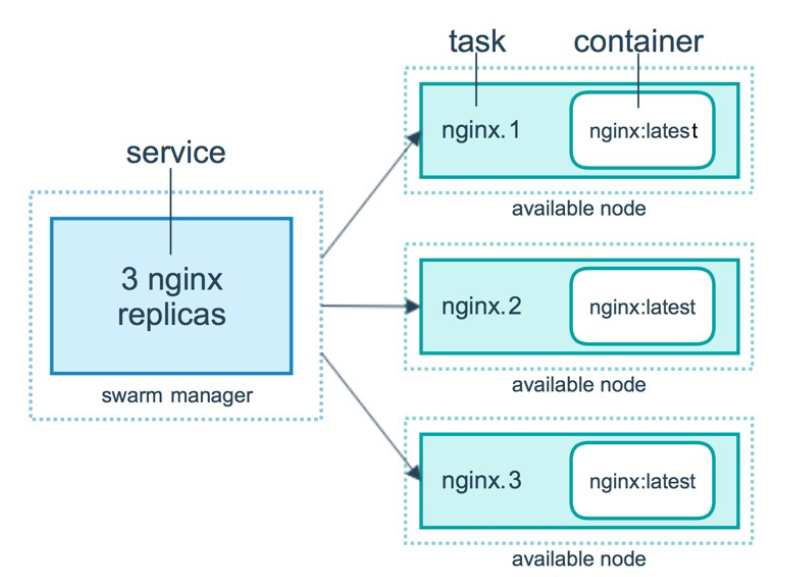

---
hide:
    - footer
---

# Docker Swarm

## Présentation et définition des termes dans docker swarm

!!!info
    Ici on aborde **docker swarm** qui est une solution de virtualisation de conteneur. Cette solution fonctionne différement que Kubernetes.

Les *nodes* sont des noeuds.

On manipule les nodes avec les commandes qui commencent par `docker node COMMAND`.

On obtient les options suivantes : 

```bash

Commands:
  demote      Demote one or more nodes from manager in the swarm
  inspect     Display detailed information on one or more nodes
  ls          List nodes in the swarm
  promote     Promote one or more nodes to manager in the swarm
  ps          List tasks running on one or more nodes, defaults to current node
  rm          Remove one or more nodes from the swarm
  update      Update a node

```

Le *swarm* est un cluster. C'est orchestrateur de serveur docker. On demande au cluster d'excuter une tâche qui s'appelle un *service*. 

Lorsque on déploie un service, l'orchestrateur va executer une *tâche*. Cette tâche est un conteneur exécuté sur une machine que nous ne connaissons pas car l'orchestrateur va décider sans nous en faire part.

<figure markdown>
  
  <figcaption>Schéma du swarm</figcaption>
</figure>

!!!abstract "Info sur les managers"
    Par défaut, dans docker swarm, le *manager* est aussi un *worker*.

## Démarrage de docker swarm 

### Démarrage de son propre cluster

Démarrage d'un swarm :

```bash
docker swarm init
```

!!!warning "Attention lors d'une configuration avec plusieurs cartes réseau"

    Si vous avez plusieurs cartes réseau, il faut en spécifier une carte via l'option `--advertise-addr` :
    ```bash
    docker swarm init --advertise-addr eth2
    ```

### Partir d'un cluster

Si on doit rejoindre un nouveau cluster, on doit partir de son cluster crée précedement. On utilise la commande :

```bash
docker swarm leave  --force
```

!!!info
    Ici on utilise le paramètre `--force` pour forcer de quitter le cluster.

On obtient un message de confirmation :

```bash hl_lines="2"
[root@LG-stream9-1 ~]# docker swarm leave -f
Node left the swarm.
```

### Rejoindre un cluster existant

Pour rejoindre un cluster, on utilise les commandes `docker swarm` :

```bash
Commands:
  ca          Display and rotate the root CA
  init        Initialize a swarm
  join        Join a swarm as a node and/or manager
  join-token  Manage join tokens
  leave       Leave the swarm
  unlock      Unlock swarm
  unlock-key  Manage the unlock key
  update      Update the swarm
```

Ici on ouvre le firewall pour le réseau interne avec `firewall-cmd` :

```bash
 firewall-cmd --zone=trusted --add-source=10.56.126.0/24 --permanent
```

On arrive dans un cluster avec un rôle de **worker**.

Pour promouvoir une machine en **manager**, on utilise :

```bash
docker node promote ID
```

### Lancement d'un premier service

Le lancement d'un service se fait avec : 

```bash
 docker service create [OPTIONS] IMAGE [COMMAND] [ARG...]
```

Exemple de création : 

```bash
docker service create --name test --publish 80:80 containous/whoami
```

Pour dupliquer le service, on utilise :

```bash 
docker service scale test=5
```

!!!info
    Ici on ajoute 4 services en plus 

On peux voir les logs avec `docker service ps test` :

```bash
ID             NAME         IMAGE                      NODE                         DESIRED STATE   CURRENT STATE            ERROR                              PORTS
y8czfynfhgw4   test.1       containous/whoami:latest   alma9-jg.local               Running         Running 6 minutes ago
0ri8oj6ixygl   test.2       containous/whoami:latest   alma9-AC                     Running         Running 4 minutes ago
vdzrheeflpo2   test.3       containous/whoami:latest   alma9-fm.local               Running         Running 4 minutes ago
mzrx1dcukyd0   test.4       containous/whoami:latest   LG-stream9-1.local           Running         Running 22 seconds ago
df8zp8cp3tqn    \_ test.4   containous/whoami:latest   stream-anto                  Shutdown        Running 4 minutes ago
bzmko7hsn59j   test.5       containous/whoami:latest   LG-stream9-1.local           Running         Running 2 minutes ago
lt35aa0y1pwi    \_ test.5   containous/whoami:latest   alma9-1-vg.formation.local   Shutdown        Shutdown 2 minutes ago
3uxy6hqg364r    \_ test.5   containous/whoami:latest   alma9-1-vg.formation.local   Shutdown        Rejected 3 minutes ago   "No such image: containous/who…"
```

!!!info "Des problèmes dans des noeuds"
    Ici on a la machine *alma9-1-vg.formation.local* qui à un problème de DNS. On a passé la machine en **DRAIN**. Cela veux dire qu'il prend uniquements des tâches de management. 

    !!!tip
        ```bash
        docker node update --availability drain alma9-1-vg.formation.local
        ```

    Le service est donc reporté sur un autre noeud :  LG-stream9-1.local

    **Si un noeud est down, docker swarm reporte encore le service vers un autre noeud.**

On réalise une mise à jour des noeuds afin de déployer une nouvelle application. Dans un premier temps, on change le parallélisme et le delai lors des mises à jours :

```bash
docker service update --detach --update-deplay 2s --update-parallelism 1 test
```

On met en suite en place la nouvelle application :

```bash
docker service update --detach  --image traefik/whoami test
```

!!!tip "L'option rollback"
    On peux faire un rollback d'une ancienne configuration :

    ```bash
    docker service rollback test
    ```

On peux trier les outputs avec :

```bash
docker service ps -f "desired-state=running" test
```

## Création d'un service via un fichier de compose.yml

Création du fichier de compose.yml :

```yaml linenums="1"
version: "3.9"

services:

  whoami:
    image: "containous/whoami"
    container_name: "lguilloux-whoami"
    ports:
      - "8003:80"
    deploy:
      mode: replicated
      replicas: 12
```

!!!info
    On peux utiliser plusieurs options :
    
    - `mode: global` qui permet de déployer sur tout les noeuds
    - `mode: replicated` qui demande une option supplémentaire avec le nombre de réplicats avec `replicas: 12` 

    !!!failure
        Si on passe d'un mode global à un mode replicated, il faut absolument enlever le service pour ensuite le recréer. 

        **Attention à la rapidité d'exection qui peut-être problématique lors de la nouvelle création du *network***

Lancement du service avec : 

```bash
docker stack deploy -c compose.yml leo
```

Pour observer, les services on peux utliser 2 commandes :

- docker stack services *nomduservice*
- docker service ls

