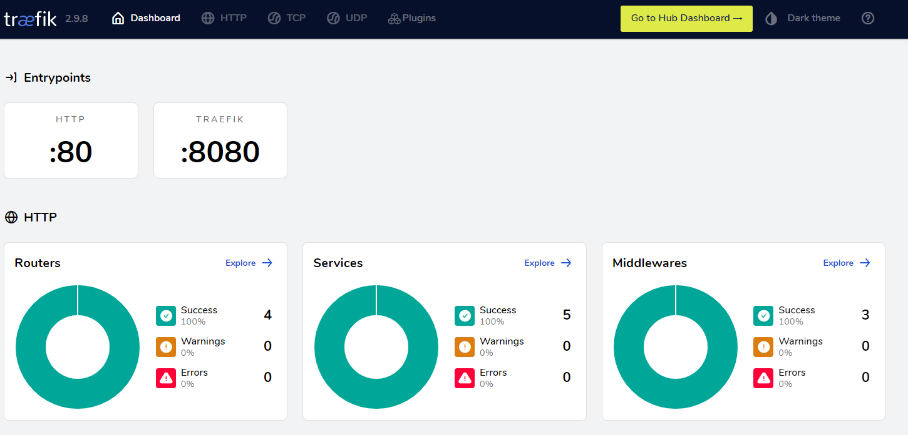

# Traefik 

## Deployement d'un traefik sous docker 

### Deploiement simple

Création d'un fichier `compose.yml` :

```yaml linenums="1"
networks:
  rp:
    name: traefik-net

services:
  proxy:
    image: traefik
    command: |-
      --providers.docker
      --log.level=debug
      --entryPoints.http.address=:80
    restart: always
    networks:
    - rp
    ports:
    - "80:80"
    volumes:
    - type: bind
      source: /var/run/docker.sock
      target: /var/run/docker.sock

  whoami:
    image: traefik/whoami
    networks:
    - rp
    labels:
    - traefik.http.routers.whoami.rule=Path(`/whoami`)
```

Lancement des conteneur :

```bash
docker compose up -d
```
!!!info
    L'option -d est très utile pour lancer les conteneurs en mode détachés.

Verification du lancement du traefik avec un `curl 127.0.0.1/whoami`:

```bash
Hostname: ab75b31dfcab
IP: 127.0.0.1
IP: 172.19.0.2
RemoteAddr: 172.19.0.3:56660
GET /whoami HTTP/1.1
Host: 127.0.0.1
User-Agent: curl/7.76.1
Accept: */*
Accept-Encoding: gzip
X-Forwarded-For: 172.19.0.1
X-Forwarded-Host: 127.0.0.1
X-Forwarded-Port: 80
X-Forwarded-Proto: http
X-Forwarded-Server: bb18d45e752b
X-Real-Ip: 172.19.0.1
```

Modification de rule en utilisant le Host. On modifie donc le fichier sur les dernière lignes :

```yaml linenums="1" hl_lines="6-7"
  whoami:
    image: traefik/whoami
    networks:
    - rp
    labels:
#    - traefik.http.routers.whoami.rule=Path(`/whoami`)
    - traefik.http.routers.whaomi.rule=Host(`truc.local`)
```

On relance les conteneurs pour la modification :

```bash
docker compose up -d
```

On teste la modification avec la commande `curl`:

```bash
curl -H "Host: truc.local"  http://127.0.0.1/
```

Réalisation de plusieurs services avec du loadbalancing :

```bash
docker compose up -d --scale whoami=2
```

On créé 2 conteneurs différents :

```bash linenums="1"
[+] Running 3/3
 ⠿ Container root-whoami-2  Started                                                                                0.6s
 ⠿ Container root-proxy-1   Running                                                                                0.0s
 ⠿ Container root-whoami-1  Started                                                                                0.9s
```

### Ajout d'un dashbord

Ajout de configuration dans le `compose.yml` :

```yaml linenums="1" hl_lines="7 17-21"
  proxy:
    image: traefik
    command: |-
      --providers.docker
      --log.level=debug
      --entryPoints.http.address=:80
      --api.insecure=true
    restart: always
    networks:
    - rp
    ports:
    - "80:80"
    volumes:
    - type: bind
      source: /var/run/docker.sock
      target: /var/run/docker.sock
    labels:
    - "traefik.http.routers.dashboard.rule=PathPrefix(`/traefik`) || PathPrefix(`/api`)"
    - "traefik.http.routers.dashboard.service=api@internal"
    - "traefik.http.routers.dashboard.middlewares=dashboard-stripprefix"
    - "traefik.http.middlewares.dashboard-stripprefix.stripprefix.prefixes=/traefik"
```

On relance le conteneur afin de pouvoir tester les modifications.

Verification du dashbord `http://10.56.126.223/traefik`:


<figure markdown>
  
  <figcaption>Image du dashbord traefik</figcaption>
</figure>


### Ajout d'une authentification

Ajout d'une ligne pour utiliser le middleware *auth-dashboard* :

```yaml linenums="1" hl_lines="21"
  proxy:
    image: traefik
    command: |-
      --providers.docker
      --log.level=debug
      --entryPoints.http.address=:80
      --api.insecure=true
    restart: always
    networks:
    - rp
    ports:
    - "80:80"
    volumes:
    - type: bind
      source: /var/run/docker.sock
      target: /var/run/docker.sock
    labels:
    - "traefik.http.routers.dashboard.rule=PathPrefix(`/traefik`) || PathPrefix(`/api`)"
    - "traefik.http.routers.dashboard.service=api@internal"
    - "traefik.http.middlewares.dashboard-stripprefix.stripprefix.prefixes=/traefik"
    - "traefik.http.routers.dashboard.middlewares=auth-dashboard,dashboard-stripprefix"
```

Génration d'un mot de passe *password* qui nous donnera un hash:

```bash
echo password | openssl passwd -apr1 -stdin
```

Modification du fichier compose.yml pour lui passer la ligne avec le mot de passe :
```yaml
labels:
    - "traefik.http.routers.dashboard.rule=PathPrefix(`/traefik`) || PathPrefix(`/api`)"
    - "traefik.http.routers.dashboard.service=api@internal"
    - "traefik.http.middlewares.dashboard-stripprefix.stripprefix.prefixes=/traefik"
    - "traefik.http.routers.dashboard.middlewares=auth-dashboard,dashboard-stripprefix"
    - "traefik.http.middlewares.auth-dashboard.basicauth.users=dashuser:$ YOUR_HACH_PASSWD"
```
!!!warning "Attention"
    Dans le mot de passe hashé, vous pouvez avoir des `$`. Si vous avez ce symbole, vous devez **absolument** le doubler.

On relance ensuite les containers et on teste la connexion avec mot de passe.

### Ajout de l'obligation de d'exposition de services

Modification du fichier compose avec les nouveautés :

```yaml linenums="1" hl_lines="7 20"
services:
  proxy:
    image: traefik
    command: |-
      --providers.docker
      --log.level=debug
      --providers.docker.exposedbydefault=false
      --entryPoints.http.address=:80
      --api.insecure=true
    restart: always
    networks:
    - rp
    ports:
    - "80:80"
    volumes:
    - type: bind
      source: /var/run/docker.sock
      target: /var/run/docker.sock
    labels:
    - traefik.enable=true
    - "traefik.http.routers.dashboard.rule=PathPrefix(`/traefik`) || PathPrefix(`/api`)"
    - "traefik.http.routers.dashboard.service=api@internal"
    - "traefik.http.middlewares.dashboard-stripprefix.stripprefix.prefixes=/traefik"
    - "traefik.http.routers.dashboard.middlewares=auth-dashboard,dashboard-stripprefix"
    - "traefik.http.middlewares.auth-dashboard.basicauth.users=dashuser:$$apr1$$nWuK9JVS$$Cm580WakVYahBvJyVuYNI1"
```

!!!info "Les doubles cotes sur les labels"
    Les doubles cotes ne sont pas obligatoire dans la déclaration d'un label.

On oublie pas de relancer les conteneurs pour prendre en compte la modification.