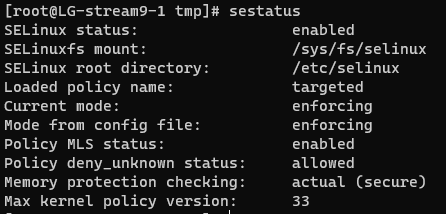
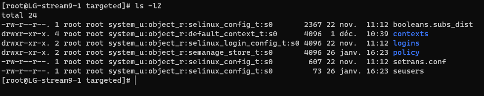

---
hide:
  - footer
---

# Se linux

## Introduction

SE Linux se base sur la sécurité de type MAC (Mandatory Access Control).

La commande `sestatus` permet d'obtenir des informations concernant la protection de SE Linux

<figure markdown>
  
  <figcaption>Exemple de protection SE Linux</figcaption>
</figure>

SE Linux possède 2 modes :

- Enforcing : cette option bloque et log
- Permissive : cette option laisse tout faire et log

Pour forcer le mode `permissive` on utilise la commande :

=== "Solution 1"

    ```sh
    setenforce 0
    ```

=== "Solution 2"

    ```sh
    setenforce Permissive
    ```

Pour forcer le mode `enforcing` on utilise la commande :

=== "Solution 1"

    ```sh
    setenforce 1
    ```

=== "Solution 2"

    ```sh
    setenforce Enforcing
    ```

Chaque fihcier et prossesus ont un label de sécurité (security context) avec une forme : 

> user:role:type(files)/domaine(processus):mls

Cette forme peut-etre lue avec les commandes : 

```sh
ls -Z /etc/hosts
```

et 

```sh
ps -Zfax
```

???+ Info

    `Z` pour lister les labels

    `f` affiche sous forme d'arbre

    `a` pour lister les porcessus des autres utilisateurs

    `x` affiche les processus qui n'ont pas de terminal de controle


Lister les règles d'une stratégie :

```sh
chcon -R -t 
``` 

???+ Info 

    `-R` pour recurcive

    `-t` pour le type

## Manipulations

### Mise à zéro de audit.log

Arret du service auditd :

```sh
systemctl stop auditd
```

Si le service ne veux pas être arrété par le biais de `systemctl`, utilisez :

```sh
service auditd stop
```

Supprimez le fichier `\var\log\audit\audit.log`

```sh
rm \var\log\audit\audit.log
```

On regarde ensuite les labels de sécurité du fichier :

```sh
ls -lZ \var\log\audit\audit.log
```

### Mise à zéro de SElinux

#### Reconstitution des labels de sécurité

!!!danger

    La reconsititution des labels de sécurités concerne tout les fichiers. Si des labels de sécurité ont été **modifiés manuellement**, ceux-ci **seront réinitialisés** par la reconsititution **sauf si ceux-ci ont été rentrés dans les configurations persistantes**.

Pour reconstruire les labels de sécurité : 

```sh
restorecon -R /
```

Pour reconstruire les labels de sécurité au **prochain démarrage** :

```sh
touch /.autorelabel
```

Au redémarrage on peut observe le relabel :


<figure markdown>
  
  <figcaption>Message au redémarrage de l'autorelabel</figcaption>
</figure>

Les templates sont stocker dans `/etc/selinux/targeted`.

<figure markdown>
  
  <figcaption>Contenu du dossier targeted</figcaption>
</figure>

Exemple d'un fichier (ici `/etc/selinux/targeted/contexts/systemd_contexts`) :

```sh
runtime=system_u:object_r:systemd_runtime_unit_file_t:s0
```

### Travail sur un serveur FTP

!!! abstract 

    Installation du serveur : **vsftpd**

On observe ensuite les labels de sécurité sur les dossiers `/var/ftp` et `/var/ftp/pub`.

On remmarque que sur les labels de sécurité, on retrouve un label *public_content_t*.

On demarre le service avec `systemctl start vsftpd`.

!!!Note 

    Le firewall bloque peut-être les connexion au ftp via le navigateur (ftp://*ipmachine*).

    On active le service firewall FTP :

    ```sh
    firewall-cmd --add-service=ftp
    ```

On se connecte avec un client ftp et une session comme root. On obteint un succès de connexion.

On s'intérresse maintenant au fichier de configuration `/etc/vsftpd/vsftpd.conf`.

On retrouve la ligne :

```sh
anonymous_enable=NO
```

La ligne ci-dessus doit être commentée afin de pouvoir autoriser les connexions anonymes.

!!!warning

    Il faut restart le service afin de prendre en compte le changement de configuration.


On va créer les dossiers pour déplacer l'attache du ftp dans `/home/ftp/pub`

???info

    On peut utiliser `mkdir -p ` avec l'option `-p` qui permet de créer les parents du dossier voulu.

On ajoute une ligne dans `/etc/vsftpd/vsftpd.conf` pour lier le ftp dans le dossier créer précédement :

```sh
anon_root=/home/ftp
```

On regarde les labels de séurité sur le dossier `ls -lZ /home/ftp/`

```sh
drwxr-xr-x. 2 root root unconfined_u:object_r:user_home_t:s0 4096 27 janv. 09:34 pub
```

!!! info

    A partir de redhat 9, on à maintenant accès au FTP .

On cherche à lister les différents modules de SE Linux avec la commande avec l'installation de tools:

```sh
dnf -y install setools-console
```

On va lister tout les règles d'autorisations :

```sh
sesearch --allow -s ftpd_t | grep " ftpd"
```

Et on obteint une information concernant la règle ci-dessus :

```sh
allow ftpd_t user_home_t:dir { create link rename reparent rmdir setattr unlink watch watch_reads };
allow ftpd_t user_home_t:file { create ioctl link lock map open read rename setattr unlink watch watch_reads write };
```