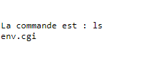

---
hide:
  - footer
---

# Se linux

## Introduction

SE Linux se base sur la sécurité de type MAC (Mandatory Access Control).

La commande `sestatus` permet d'obtenir des informations concernant la protection de SE Linux

<figure markdown>
  
  <figcaption>Exemple de protection SE Linux</figcaption>
</figure>

SE Linux possède 2 modes :

- Enforcing : cette option bloque et log
- Permissive : cette option laisse tout faire et log

Pour forcer le mode `permissive` on utilise la commande :

=== "Solution 1"

    ```sh
    setenforce 0
    ```

=== "Solution 2"

    ```sh
    setenforce Permissive
    ```

Pour forcer le mode `enforcing` on utilise la commande :

=== "Solution 1"

    ```sh
    setenforce 1
    ```

=== "Solution 2"

    ```sh
    setenforce Enforcing
    ```

Chaque fihcier et prossesus ont un label de sécurité (security context) avec une forme : 

> user:role:type(files)/domaine(processus):mls

Cette forme peut-etre lue avec les commandes : 

```sh
ls -Z /etc/hosts
```

et 

```sh
ps -Zfax
```

???+ Info

    `Z` pour lister les labels

    `f` affiche sous forme d'arbre

    `a` pour lister les porcessus des autres utilisateurs

    `x` affiche les processus qui n'ont pas de terminal de controle


Lister les règles d'une stratégie :

```sh
chcon -R -t 
``` 

???+ Info 

    `-R` pour recurcive

    `-t` pour le type

## Manipulations

### Mise à zéro de audit.log

Arret du service auditd :

```sh
systemctl stop auditd
```

Si le service ne veux pas être arrété par le biais de `systemctl`, utilisez :

```sh
service auditd stop
```

Supprimez le fichier `\var\log\audit\audit.log`

```sh
rm \var\log\audit\audit.log
```

On regarde ensuite les labels de sécurité du fichier :

```sh
ls -lZ \var\log\audit\audit.log
```

### Mise à zéro de SElinux

#### Reconstitution des labels de sécurité

!!!danger

    La reconsititution des labels de sécurités concerne tout les fichiers. Si des labels de sécurité ont été **modifiés manuellement**, ceux-ci **seront réinitialisés** par la reconsititution **sauf si ceux-ci ont été rentrés dans les configurations persistantes**.

Pour reconstruire les labels de sécurité : 

```sh
restorecon -R /
```

Pour reconstruire les labels de sécurité au **prochain démarrage** :

```sh
touch /.autorelabel
```

Au redémarrage on peut observe le relabel :


<figure markdown>
  
  <figcaption>Message au redémarrage de l'autorelabel</figcaption>
</figure>

Les templates sont stocker dans `/etc/selinux/targeted`.

<figure markdown>
  
  <figcaption>Contenu du dossier targeted</figcaption>
</figure>

Exemple d'un fichier (ici `/etc/selinux/targeted/contexts/systemd_contexts`) :

```sh
runtime=system_u:object_r:systemd_runtime_unit_file_t:s0
```

### Travail sur un serveur FTP

!!! abstract 

    Installation du serveur : **vsftpd**

On observe ensuite les labels de sécurité sur les dossiers `/var/ftp` et `/var/ftp/pub`.

On remmarque que sur les labels de sécurité, on retrouve un label *public_content_t*.

On demarre le service avec `systemctl start vsftpd`.

!!!Note 

    Le firewall bloque peut-être les connexion au ftp via le navigateur (ftp://*ipmachine*).

    On active le service firewall FTP :

    ```sh
    firewall-cmd --add-service=ftp
    ```

On se connecte avec un client ftp et une session comme root. On obteint un succès de connexion.

On s'intérresse maintenant au fichier de configuration `/etc/vsftpd/vsftpd.conf`.

On retrouve la ligne :

```sh
anonymous_enable=NO
```

La ligne ci-dessus doit être commentée afin de pouvoir autoriser les connexions anonymes.

!!!warning

    Il faut restart le service afin de prendre en compte le changement de configuration.


On va créer les dossiers pour déplacer l'attache du ftp dans `/home/ftp/pub`

???info

    On peut utiliser `mkdir -p ` avec l'option `-p` qui permet de créer les parents du dossier voulu.

On ajoute une ligne dans `/etc/vsftpd/vsftpd.conf` pour lier le ftp dans le dossier créer précédement :

```sh
anon_root=/home/ftp
```

On regarde les labels de séurité sur le dossier `ls -lZ /home/ftp/`

```sh
drwxr-xr-x. 2 root root unconfined_u:object_r:user_home_t:s0 4096 27 janv. 09:34 pub
```

!!! info

    A partir de redhat 9, on à maintenant accès au FTP .

On cherche à lister les différents modules de SE Linux avec la commande avec l'installation de tools:

```sh
dnf -y install setools-console
```

On va lister tout les règles d'autorisations :

```sh
sesearch --allow -s ftpd_t | grep " ftpd"
```

Et on obteint une information concernant la règle ci-dessus :

```sh linenums="1"
allow ftpd_t user_home_t:dir { create link rename reparent rmdir setattr unlink watch watch_reads };
allow ftpd_t user_home_t:file { create ioctl link lock map open read rename setattr unlink watch watch_reads write };
```

On peux filtrer aussi avec :

```sh
sesearch --allow -s ftpd_t -t user_home_t
```

On obteint :

```sh linenums="1" hl_lines="12 13"
allow daemon user_home_t:file { append getattr };
allow domain file_type:blk_file map; [ domain_can_mmap_files ]:True
allow domain file_type:chr_file map; [ domain_can_mmap_files ]:True
allow domain file_type:file map; [ domain_can_mmap_files ]:True
allow domain file_type:lnk_file map; [ domain_can_mmap_files ]:True
allow ftpd_t file_type:filesystem getattr;
allow ftpd_t non_security_file_type:dir { add_name create getattr ioctl link lock open read remove_name rename reparent rmdir search setattr unlink watch watch_reads write }; [ ftpd_full_access ]:True
allow ftpd_t non_security_file_type:dir { add_name getattr ioctl lock open read remove_name search write }; [ ftpd_full_access ]:True
allow ftpd_t non_security_file_type:dir { add_name getattr ioctl lock open read remove_name search write }; [ ftpd_full_access ]:True
allow ftpd_t non_security_file_type:file { append create getattr ioctl link lock open read rename setattr unlink watch watch_reads write }; [ ftpd_full_access ]:True
allow ftpd_t non_security_file_type:lnk_file { append create getattr ioctl link lock read rename setattr unlink watch watch_reads write }; [ ftpd_full_access ]:True
allow ftpd_t user_home_t:dir { create link rename reparent rmdir setattr unlink watch watch_reads };
allow ftpd_t user_home_t:file { create ioctl link lock map open read rename setattr unlink watch watch_reads write };
allow userdom_filetrans_type user_home_t:dir { add_name getattr ioctl lock open read remove_name search write };
```

### Exploration de SElinux avec les ports 

Installation de apache avec le package ***httpd***.

Une fois l'installation terminée, on modifie le port de Apache dans le fichier de configuration (`/etc/httpd/conf/httpd.conf`) :

```conf
Listen 8888
```

!!!warning
    **Pour activer la modification, il faut redémarrer le service ou le démarrer si cela n'a pas été fait à l'installation**

    Pour redémarrer :

    ```sh
    systemctl restart httpd
    ```

    Pour démarrer le service :
    
    ```sh
    systemctl start httpd
    ```

Avec le restart, on obteint une erreur de configuration :

```sh linenums="1"
Job for httpd.service failed because the control process exited with error code.
See "systemctl status httpd.service" and "journalctl -xeu httpd.service" for details.
```

Si on observe les logs avec `journalctl -u httpd | tail`, on remarque que le port 8888 provoque un problème :

```sh linenums="1"  hl_lines="2 3"
janv. 27 11:15:33 LG-stream9-1.local systemd[1]: Starting The Apache HTTP Server...
janv. 27 11:15:35 LG-stream9-1.local httpd[1865]: (13)Permission denied: AH00072: make_sock: could not bind to address [::]:8888
janv. 27 11:15:35 LG-stream9-1.local httpd[1865]: (13)Permission denied: AH00072: make_sock: could not bind to address 0.0.0.0:8888
janv. 27 11:15:35 LG-stream9-1.local httpd[1865]: no listening sockets available, shutting down
janv. 27 11:15:35 LG-stream9-1.local httpd[1865]: AH00015: Unable to open logs
janv. 27 11:15:35 LG-stream9-1.local systemd[1]: httpd.service: Main process exited, code=exited, status=1/FAILURE
janv. 27 11:15:35 LG-stream9-1.local systemd[1]: httpd.service: Failed with result 'exit-code'.
janv. 27 11:15:35 LG-stream9-1.local systemd[1]: Failed to start The Apache HTTP Server.
```

On cherche aussi dans `/var/log/audit/audit.log` avec la commane `grep avc /var/log/audit/audit.log`

```sh linenums="1"
type=AVC msg=audit(1674814535.950:140): avc:  denied  { name_bind } for  pid=1865 comm="httpd" src=8888 scontext=system_u:system_r:httpd_t:s0 tcontext=system_u:object_r:unreserved_port_t:s0 tclass=tcp_socket permissive=0
type=AVC msg=audit(1674814535.953:141): avc:  denied  { name_bind } for  pid=1865 comm="httpd" src=8888 scontext=system_u:system_r:httpd_t:s0 tcontext=system_u:object_r:unreserved_port_t:s0 tclass=tcp_socket permissive=0
```

On utilise *audit2* pour comprendre le problème avec la commande (`grep avc /var/log/audit/audit.log | tail -n -1 | audit2why`):

```sh linenums="1"

Was caused by:
The boolean nis_enabled was set incorrectly.
Description:
Allow nis to enabled
Allow access by executing:
# setsebool -P nis_enabled 1
```

Puis on cherche de savoir comment résoudre ce problème avec *audit2* avec la commande (`grep avc /var/log/audit/audit.log | tail -n -1 | audit2allow`):

```sh linenums="1"
#============= httpd_t ==============

#!!!! This avc can be allowed using the boolean 'nis_enabled'
allow httpd_t unreserved_port_t:tcp_socket name_bind;
```

!!!danger
    **Attention cela provoque une faille de sécurité. Nous allons donc passer par *semanage*.**

Pour lister tout les ports avec *semanage* (`semanage port -l | grep http` ) :

```sh linenums="1" hl_lines="3"
http_cache_port_t              tcp      8080, 8118, 8123, 10001-10010
http_cache_port_t              udp      3130
http_port_t                    tcp      80, 81, 443, 488, 8008, 8009, 8443, 9000
pegasus_http_port_t            tcp      5988
pegasus_https_port_t           tcp      5989
```

Ici on peut découvrir tout les ports, on modifie alors le label http pour autoriser le port 8888 :

```sh 
semanage port -a -t http_port_t -p tcp 8888
```

Si on observe les ports, on le retrouve dans la liste :

```sh linenums="1" hl_lines="3"
http_cache_port_t              tcp      8080, 8118, 8123, 10001-10010
http_cache_port_t              udp      3130
http_port_t                    tcp      8888, 80, 81, 443, 488, 8008, 8009, 8443, 9000
pegasus_http_port_t            tcp      5988
pegasus_https_port_t           tcp      5989
```

On redémarre alors le service **httpd** et on obteint aucune erreurs.

### Les booléens dans SElinux

??? info    "Prérequis pour réaliser cette activité"
    Il est nécéssaire d'avoir un serveur web (par exemple httpd autrement dit apache).

    Ici nous utilisons le serveur web précédement installé et sur le port 8888. Normalement, le port par défaut est 80.

Création d'un fichier `/var/www/cgi-bin/env.cgi` contenant :

```sh linenums="1"
#!/bin/bash

echo -e "Content-Type: text/plain\n\n"

set
```

On rend ensuite le fichier executable pour tout le monde :

```sh 
chmod 755 /var/www/cgi-bin/env.cgi
```

Puis on test avec un curl :

```sh
curl http://127.0.0.1:8888/cgi-bin/env.cgi
```


???+warning "Attention au firewall"
    Attention le firewall peut bloquer la communication sur le port 8888. Il faut autoriser le trafic sur le port :

    ```sh 
    firewall-cmd --add-port=8888/tcp
    ```

Petite modification du fichier `/var/www/cgi-bin/env.cgi` pour executer des requetes dans l'URL:

```sh linenums="1"
#!/bin/bash

echo -e "Content-Type: text/plain\n\n"

echo "La commande est : $QUERY_STRING"
CMD=$(echo $QUERY_STRING | sed 's,%20, ,g')
$CMD
```

Si on test le script dans le navigateur avec la commande  `curl http://172.19.252.60:8888/cgi-bin/env.cgi?ls`:

<figure markdown>
  
  <figcaption>Exemple avec la commande ls</figcaption>
</figure>

!!!danger 
    Attention, les commandes sont executées avec l'identité du user `wwwdata`. 

    **Le utlisateur possède donc tout les droits de créations et autres liés à `wwwdata`.**

Pour la sécurité, on va désactiver toutes les executions des .cgi :

```sh
 getsebool -a | grep http
```

On désactive alors l'execution des CGI :

```sh 
setsebool -P httpd_enable_cgi off
```

!!!tip 
    Attention au mode de selinux car si il est en *permissive* cela laissera actif l'execution des CGI.
