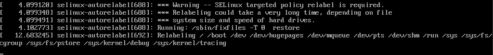

---
hide:
  - footer
---

# Se linux

## Introduction

SE Linux se base sur la sécurité de type MAC (Mandatory Access Control).

La commande `sestatus` permet d'obtenir des informations concernant la protection de SE Linux

<figure markdown>
  
  <figcaption>Exemple de protection SE Linux</figcaption>
</figure>

SE Linux possède 2 modes :

- Enforcing : cette option bloque et log
- Permissive : cette option laisse tout faire et log

Pour forcer le mode `permissive` on utilise la commande :

=== "Solution 1"

    ```sh
    setenforce 0
    ```

=== "Solution 2"

    ```sh
    setenforce Permissive
    ```

Pour forcer le mode `enforcing` on utilise la commande :

=== "Solution 1"

    ```sh
    setenforce 1
    ```

=== "Solution 2"

    ```sh
    setenforce Enforcing
    ```

Chaque fihcier et prossesus ont un label de sécurité (security context) avec une forme : 

> user:role:type(files)/domaine(processus):mls

Cette forme peut-etre lue avec les commandes : 

```sh
ls -Z /etc/hosts
```

et 

```sh
ps -Zfax
```

???+ Info

    `Z` pour lister les labels

    `f` affiche sous forme d'arbre

    `a` pour lister les porcessus des autres utilisateurs

    `x` affiche les processus qui n'ont pas de terminal de controle


Lister les règles d'une stratégie :

```sh
chcon -R -t 
``` 

???+ Info 

    `-R` pour recurcive

    `-t` pour le type

## Manipulations

### Mise à zéro de audit.log

Arret du service auditd :

```sh
systemctl stop auditd
```

Si le service ne veux pas être arrété par le biais de `systemctl`, utilisez :

```sh
service auditd stop
```

Supprimez le fichier `\var\log\audit\audit.log`

```sh
rm \var\log\audit\audit.log
```

On regarde ensuite les labels de sécurité du fichier :

```sh
ls -lZ \var\log\audit\audit.log
```

### Mise à zéro de SElinux

#### Reconstitution des labels de sécurité

!!!danger

    La reconsititution des labels de sécurités concerne tout les fichiers. Si des labels de sécurité ont été **modifiés manuellement**, ceux-ci **seront réinitialisés** par la reconsititution **sauf si ceux-ci ont été rentrés dans les configurations persistantes**.

Pour reconstruire les labels de sécurité : 

```sh
restorecon -R /
```

Pour reconstruire les labels de sécurité au **prochain démarrage** :

```sh
touch /.autorelabel
```

Au redémarrage on peut observe le relabel :


<figure markdown>
  
  <figcaption>Message au redémarrage de l'autorelabel</figcaption>
</figure>

