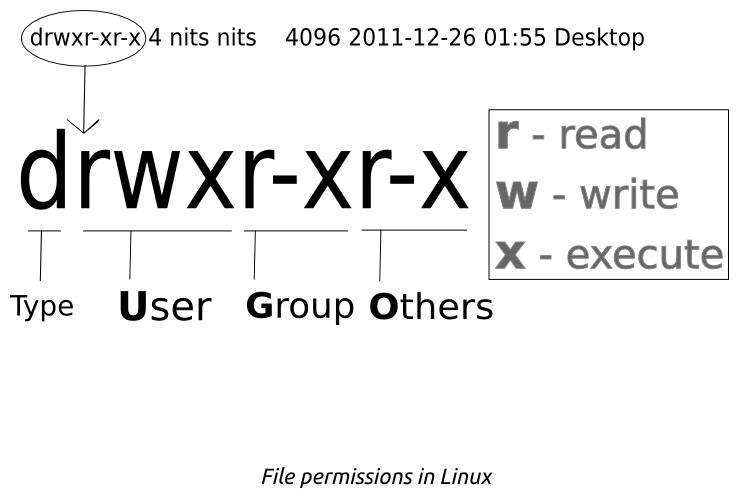

---
hide:
  - footer
---


# Les permissions

## Liste des permissions

Commande pour obtenir des informations concernant les droits :

```sh
ls -l
```

On obteint plusieurs groupes :



- x : pour se déplacer dedans (pour les fichier, on execute le fichier tel qu'un script)
- w : modification de contenu avec l'ajout, la modification ou la suppression d'octect (en fichiers ou en repertoires)
- r : lecture et copie des fichiers ( répertoire : lister les fichiers)
- s : Il confère l'identité du propriétaire de la commande (avec `passwd` par exemple)
- t : on trouve la permission sur tout les dossiers temporaires/partages. **Seul le propriètaire du fichier peut le supprimer.** (sticky-bit)


## Commandes de changements de permissions

- `chown` : pour modifier mes permissions du fichier
- `chgrp` : L'administrateur et l'utilisateur peuvent modifier les permissions
- `chmod`: Permet de changer les permissions d'accès d'un fichier ou d'un répertoire (il faut etre propriètaire du fichier)

Pour chercher les fichiers qui possède le droit `s` :

```sh
find -perm /u=s
```

Et on obtient une liste de fichier plus ou moins longue si docker est installé : 

<figure markdown>
  
  <figcaption>Liste des fichiers possèdant le droit permettant une élévation de privilèges</figcaption>
</figure>

!!! Info
    On peux ajouter une option `-o` pour faire un or et donc lier plusieurs arguments

    Exemple : `find / -perm /u=s -o -perm /g=s`

## Les capabilities 

### Premières notions sur les capabilities

Installation des pages de man (si elles ne sont pas présentes) :

```sh
dnf -y install man-pages
```

Overture du man de `capabilities` :

```sh
man capabilities
```

Les capabilities ont 2 catégories :

- les processus priviliégiés 
- les processes non priviliégiés

**Les processus priviliégiés** sont appellé par un superutilisateur ou root. Ils contournent les verfications du noyaux.

**Les processus non priviliégiés** sont soumis à une verification basée sur le processus.

Les options :

-  `CAP_DAC_OVERRIDE` permet à root de contourner les vérification de lecture et d'écritures
-  `CAP_NET_BIND_SERVICE` permet de lier un socket aux ports préviliégiés (inférieur à 1024)
-  `CAP_CHOWN` permet d'apporter des modifications sur les fichiers

### Tests de la commande NC

Avec la commande `NC`, cela permet de déclarer un serveur d'écoute et ainsi de pouvoir communiquer entre 2 ordinateurs distants

???+ tip
    Pour pouvoir utiliser les commandes NC, il faut l'installer :

    ```sh
    dnf -y install nc
    ```

L'utilisation de nc se réalise avec 2 terminaux afin de pouvoir créer comme un canal de communication entre les deux terminaux.

On lance avec un user sans droits sudo la commande : `nc -l 90`

On obtient alors une erreur:

```sh
Ncat: bind to :::90: Permission denied. QUITTING.
```

??? Rappel "Rappel sur les commandes de groupes et users"
    
    Ajout d'un groupe nommé ncusers :
    
    ```sh
    groupadd ncusers
    ```
    Ajout d'un utilisateur avec le groupe ncusers
    ```sh
    useradd -g ncusers ncuser
    ```

On copie le dossier nc dans le tmp :

```sh
cp /bin/nc /tmp/capnc
```

Mise en place des droits :

```sh
install -o ncuser -g ncusers -m 700 /bin/nc /tmp/capnc
```

Règlage des droits avec la commande setcap :

```sh
 setcap  cap_net_bind_service=ep  /tmp/capnc
```

Vérification des droits sur le dossier : 

```sh
getcap /tmp/capnc
```

Puis on vérifie si les droits focntionne avec la connexion sur le ncuser puis l'indication de la commande : 

```sh
su - ncuser -c "/tmp/capnc -l 90"
```