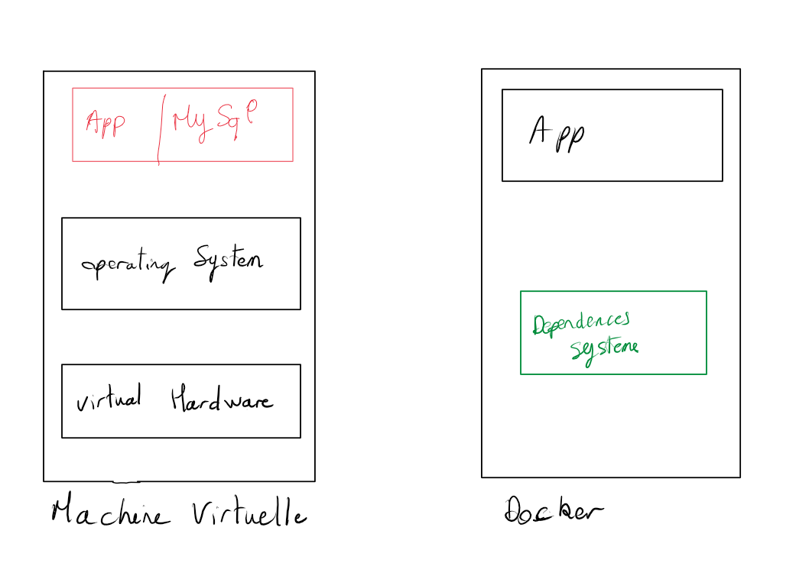
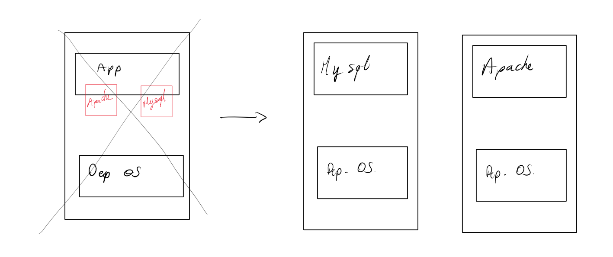
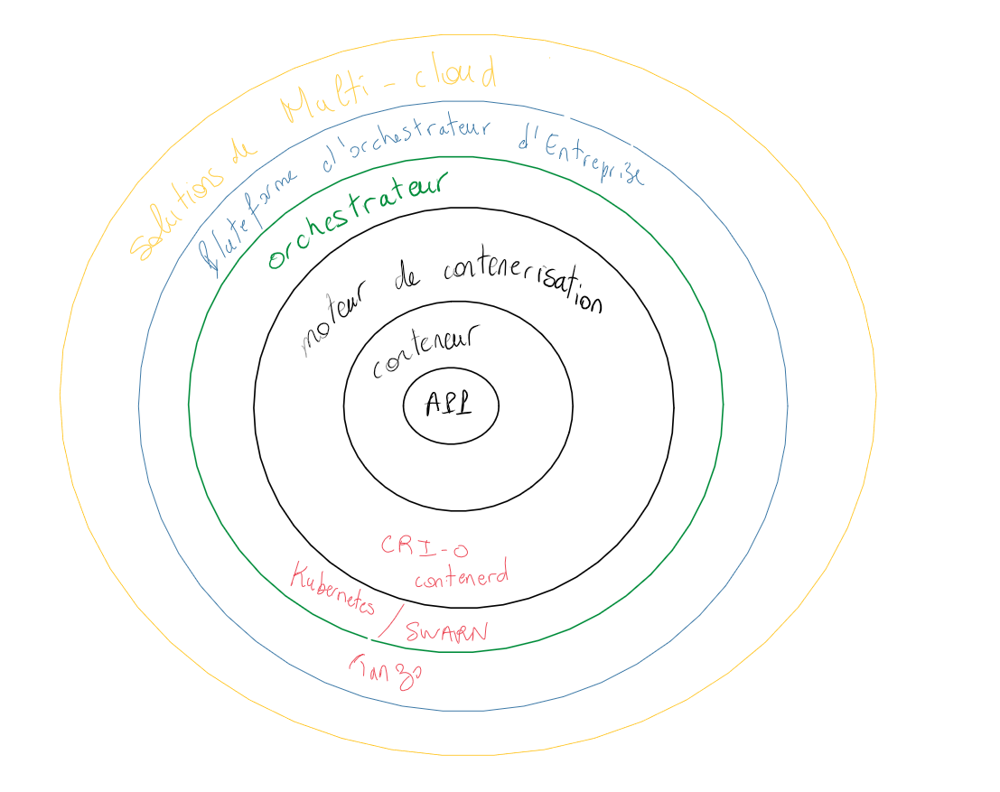

---
hide:
  - footer
---

# La vitrualisation

## Rappel sur les VM et les conteneurs

### Différence entre la VM et le conteneur

<figure markdown>
  
  <figcaption>Rappel sur la virtualisation et les conteneurs</figcaption>
</figure>

Les VM hébergent un système virtuel complet comprenant le hardware (physique) et l'OS (Opérating Système). Coté conteneurs, celui-ci est utilisé pour :

- la performance
- les ressources
- Facilite la MCO ( + vite , + leger et un versionning avancé)
- Le prix
- Gain d'agilité
- Mise à l'échelle plus facile

Les conteneurs dépendent d'une seule et unique application.

<figure markdown>
  
  <figcaption>Principe du conteneur</figcaption>
</figure>

### L'architecture des conteneur détaillé

Le conteneur possède tout son environement tout autour de l'application

<figure markdown>
  
  <figcaption>Principe du conteneur - Architecture</figcaption>
</figure>

