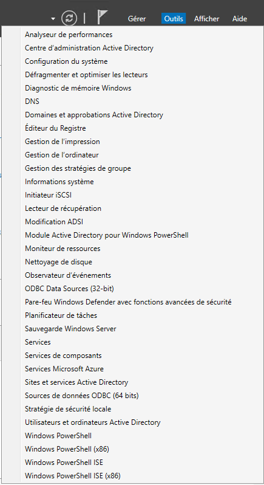
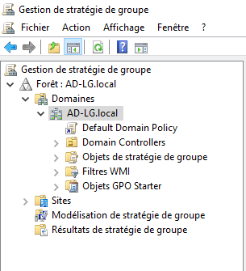
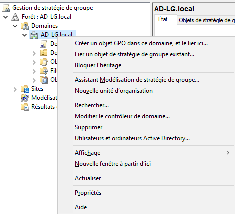
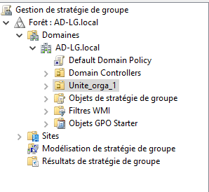
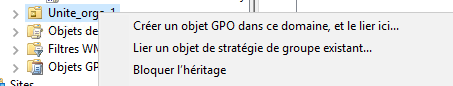
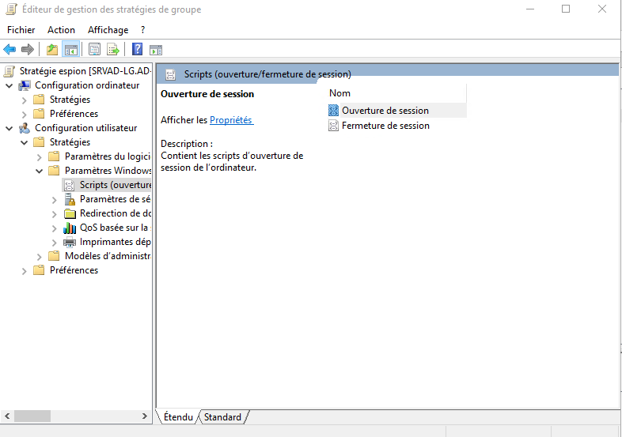
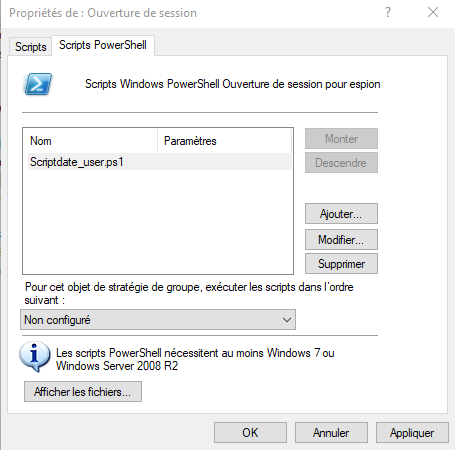
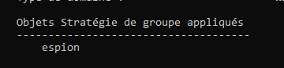

---
hide:
  - footer
---

Nous avons un script à déployer sur toutes les machines du domaine. Ce script doit : 

- S'executer au démarrage de la session
- Les utilisateurs dans les OU choisi doivent avoir se script

!!! info
    OU = Unité d'organisation

## Création d'un OU

Pour créer un OU, le serveur (ici un Windows serveur 2019) doit être un serveur AD.

Le serveur AD doit être promu en contrôleur de domaine.

La création d'OU, intervient dans les outils du **gestionnaire de serveur** puis dans dans **gestion des stratégies de groupe**.

<figure markdown>
  
  <figcaption>Outils de l'AD</figcaption>
</figure>

On obtient ensuite une fenêtre avec la forêt.

<figure markdown>
  
  <figcaption>Gestion des stratégies de groupes</figcaption>
</figure>

On utlise ensuite le **clic droit** -> **Nouvelle unité d'organsiation**

<figure markdown>
  
  <figcaption>Création de l'OU</figcaption>
</figure>

Donnez ensuite un nom à votre OU. 

On retrouve cette OU dans la foret sous les domaines

<figure markdown>
  
  <figcaption>Unité organisation 1</figcaption>
</figure>

## Création de la GPO

Une fois l'OU crée, vous pouvez vous positionner sur celle-ci et faire **Clic droit** -> **Créér un objet GPO**

Mettez un nom à cette GPO.

<figure markdown>
  
  <figcaption>Création de la GPO</figcaption>
</figure>

Faites **clic droit** sur la GPO puis **modifier** là.

Ici nous allons dans les stratégies de scripts d'ouverture de sessions.

<figure markdown>
  
  <figcaption>Localisation des scripts d'ouverture de sessions</figcaption>
</figure>

On ajoute le script (ici un script powershell) dans l'onglet Powershell. Quand on met un script, il faut garder le dossier par défaut et mettre le script dans ce dossier.

```txt
\\AD-LG.local\SysVol\AD-LG.local\Policies\{53DB8C41-12CE-42EE-9DD9-509CA44D262A}\User\Scripts\Logon
```
Ici le chemin avec le numéro de la GPO.


On vérifie ensuite le nom du script.

<figure markdown>
  
  <figcaption>Onglet powershell</figcaption>
</figure>

Sur la machine cliente, on peux voir avec un `GPRESULT /R` l'état de la GPO.

On vérifie que la GPO *espion* est bien présent.

<figure markdown>
  
  <figcaption>Verificiation du scripts d'ouverture de sessions</figcaption>
</figure>
