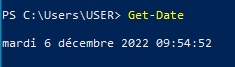
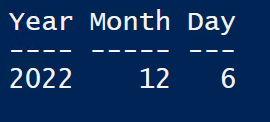
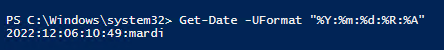

---
hide:
  - footer
---

## Comment obtenir la date en Powershell

On utilise la commande : 

```powershell linenums="1"
Get-Date
```
<figure markdown>
  
  <figcaption>Résultat de la commande Get-date</figcaption>
</figure>


## Obtenir certaines informations d'après une commande

!!! note  
    Les opérateurs sont référencés sur le site : https://ss64.com/ps/ 

On souhaite récupérer les différents membre de la date affichée par powershell :

```powershell linenums="1"
Get-Date | Get-Member
```

<figure markdown>
  
  <figcaption>Résultat de la damande des membres</figcaption>
</figure>

Dans le cas de la commande *Get-member* et de Powershell en général, nous avons un language orienté objet.

On récupère les quelques informations :

```powershell linenums="1"
Get-Date | Select-Object -Property Year, Month , Day
```

Cette commande nous donne un tableau de valeur : 

<figure markdown>
  
  <figcaption>Tableau de date</figcaption>
</figure>

On stocke la valeur dans une variable temporaire : 

```powershell linenums="1"
$DATE = Get-Date

$DATE.Day
```
On récupère uniquement la valeur de la date.

!!! info
    On peux aussi récupèrer la valeur d'un autre façon :
    ```powershell
    (Get-Date).Day
    ```
- Cherche une chaine de caractères :

    ```powershell
    Get-Date -UFormat "%Y:%m:%d:%R:%A"
    ```

<figure markdown>
  
  <figcaption>Chaine de caractère obtenue</figcaption>
</figure>

On prend le nom d'utilisateur :

```powershell linenums="1"
$env:USERNAME
```

On va ensuite aller chercher les différentes informations avec leur position :

```powershell linenums="1"
"{0,-20}:{1:yyyy}:{2:MM}" -f $env:USERNAME, (Get-Date).Year , (Get-Date).Month
```

!!! info
    - On utilise les `{}` pour donner la position + le formatage
    - L'option `-f` permet de réaliser le formatage
    - Les différentes informations sont séparées par une virgule `,`

Pour afficher et créer un fichier avec les informations voulue :

```powershell linenums="1"
$export = "{0,-20}:{1:yyyy}:{2}:{3}:{4}" -f $env:USERNAME, (Get-Date),(Get-Date).Month,(Get-Date).Day,(Get-Date).DayOfWeek
Write-Output $export

# Export dans un txt
# On verifi si le fichier existe
$file = ".\export.txt"
if (!(Test-Path -Path $file)){
    #Si il existe pas on le créer
    New-Item -Path $file
}
# On ajoute notre ligne dans le fichier 
ADD-content -path $file -value $export

```